<div align="center">

# 🗒️ MeetingNote Pro

**녹취 한 번 올리면 요약 · 결정사항 · 할 일이 알아서 나뉘는, 팀을 위한 회의록**

받아쓰기와 정리는 Gemini가, 할 일 추적은 칸반이, 기록은 활동 로그가 맡습니다.

[](https://meetingnote-pro.vercel.app)
[](https://meetingnote-pro.vercel.app/docs)


<br>

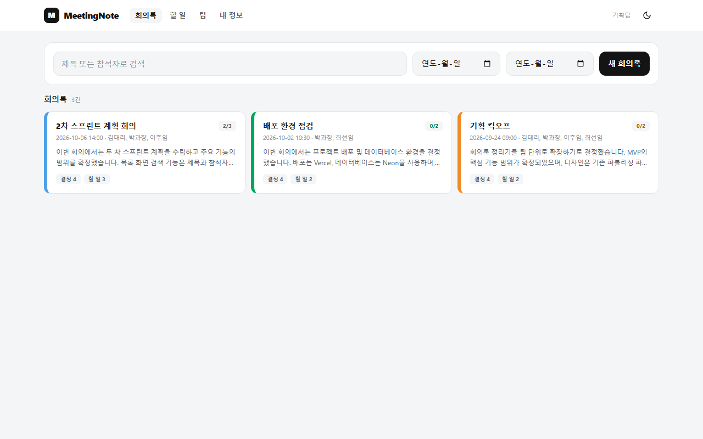

</div>

---

## ✨ 한눈에 보기

> **「로그인한 팀이 함께 쓰는 회의록 — 녹취를 받아쓴 본문이 요약 · 결정사항 · 할 일로 나뉘고, 할 일은 칸반으로 추적되며, 댓글과 활동 기록이 보존된다」**

| | |
|---|---|
| 🎙️ **받아쓰기** | mp3 · wav 녹취를 올리면 Gemini가 한국어 본문으로 받아 적습니다 |
| 🧠 **자동 정리** | 본문에서 *요약 3~5줄 · 합의가 끝난 결정사항 · 담당자/기한이 드러난 할 일*만 뽑습니다. 담당자를 **지어내지 않습니다** |
| 📋 **칸반** | 대기 → 진행 → 완료. 카드를 끌어 놓거나 눌러서 옮기고, 지난 기한은 빨간 띠로 알려 줍니다 |
| 👥 **팀** | 초대코드 하나로 합류. 한 사람 한 팀, 팀당 6명, owner / member 두 등급 |
| 💬 **댓글 · 활동 기록** | 결정에 의견을 달고, 누가 무엇을 했는지 최근 50건을 봅니다 |
| 🌗 **다크 모드 · 360px 반응형** | 라이트/다크 한 벌의 디자인 토큰, 가장 좁은 화면에서도 깨지지 않습니다 |

<br>

## 📸 화면

<table>
<tr>
<td width="50%" valign="top">

**① 회의록 목록** — 제목·참석자 검색, 기간 거름, 카드 띠 색은 순서대로 순환


</td>
<td width="50%" valign="top">

**② 녹취 올리기 → 받아쓰기 완료** — 업로드 진행 표시, 본문이 채워진 상태에서 「정리하기」
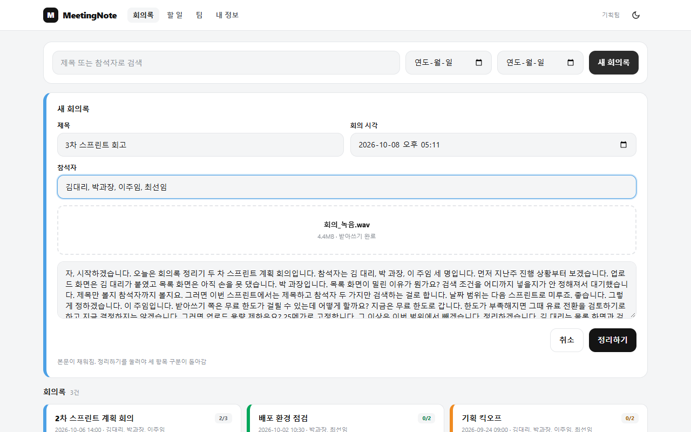

</td>
</tr>
<tr>
<td width="50%" valign="top">

**③ 회의록 상세** — 요약 · 결정사항 · 할 일 세 칸 + 댓글. 본문은 접어 두고 세 칸을 먼저 읽게 합니다
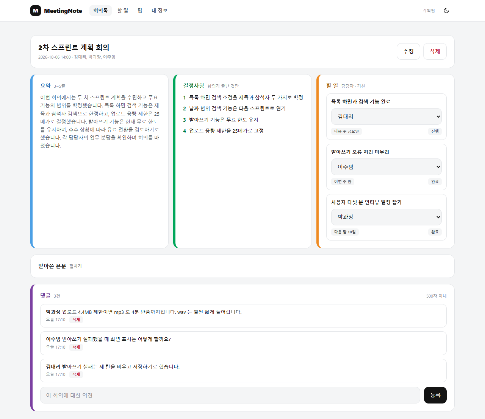

</td>
<td width="50%" valign="top">

**④ 할 일 칸반** — 끌어 놓기 / 눌러서 칸 고르기 / 담당자·기한 바꾸기. 빨간 띠는 기한 지남
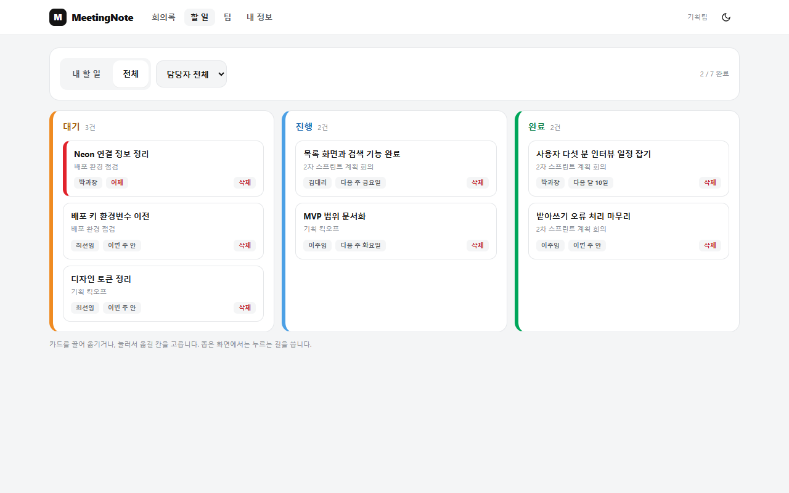

</td>
</tr>
<tr>
<td width="50%" valign="top">

**⑤ 팀 설정** — 초대코드 복사·재발급(owner), 멤버별 할 일 수, 팀 활동 기록
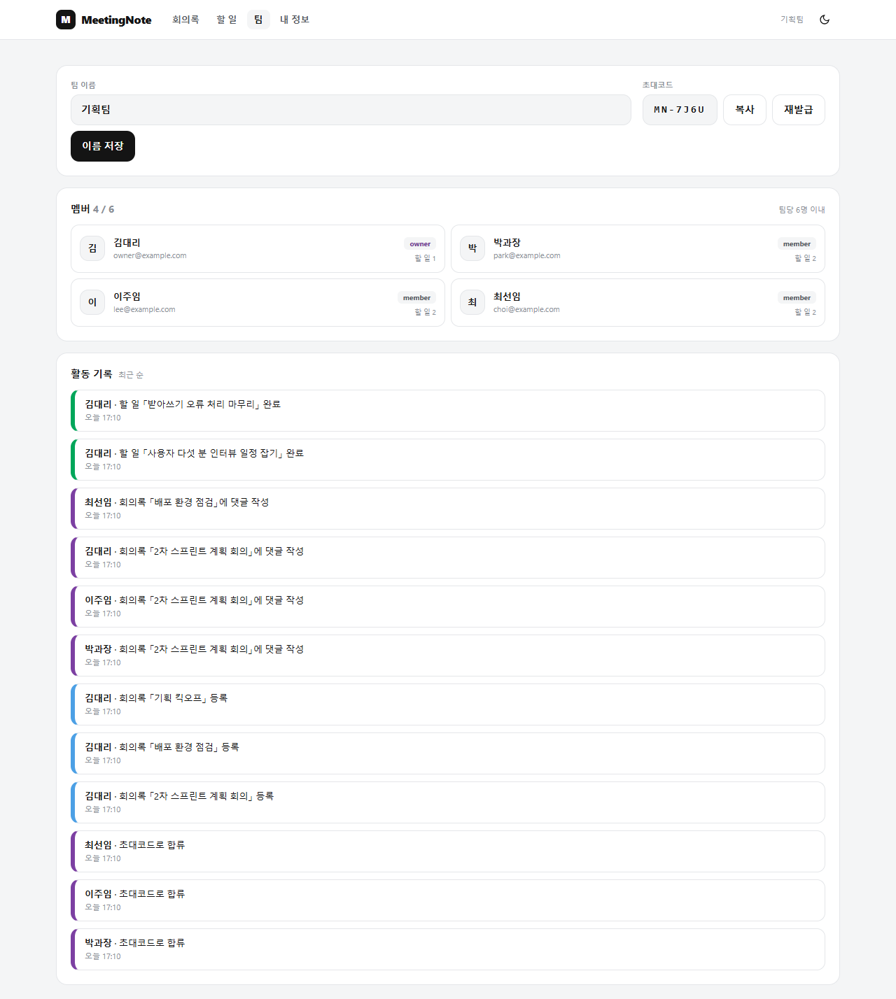

</td>
<td width="50%" valign="top">

**⑥ 내 정보** — 이름 변경, 비밀번호 변경(현재 비밀번호 확인), 내 할 일 · 내 활동
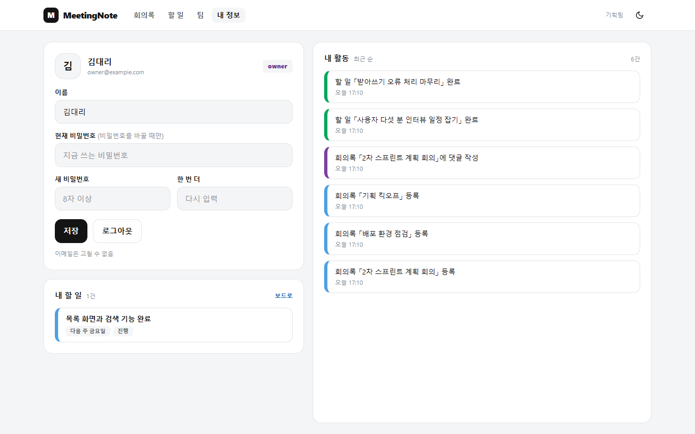

</td>
</tr>
</table>

<details>
<summary><b>🌙 다크 모드</b></summary>
<br>

| 회의록 목록 | 회의록 상세 | 할 일 칸반 |
|:---:|:---:|:---:|
| 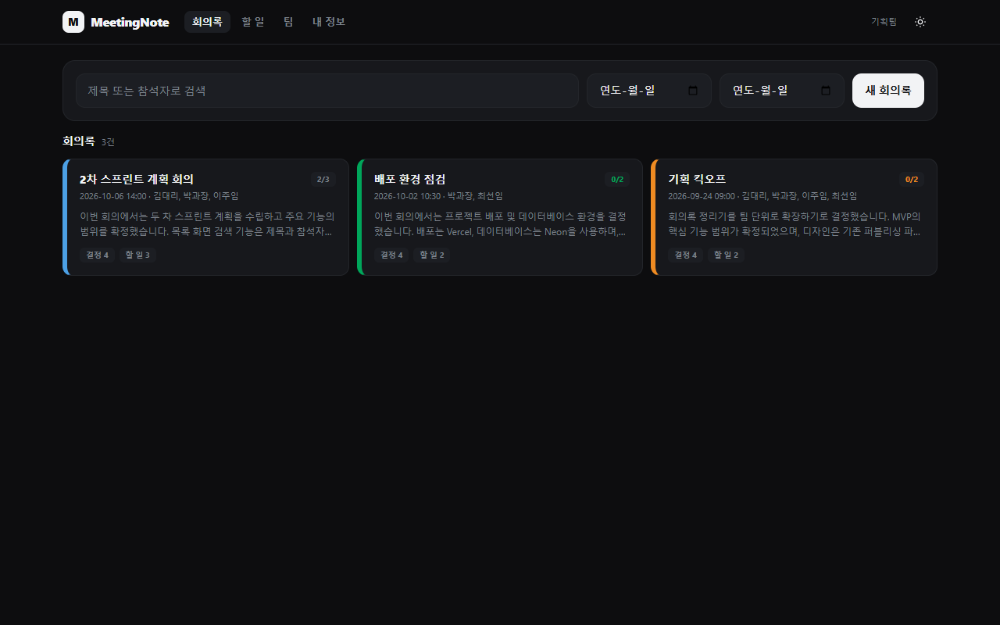 | 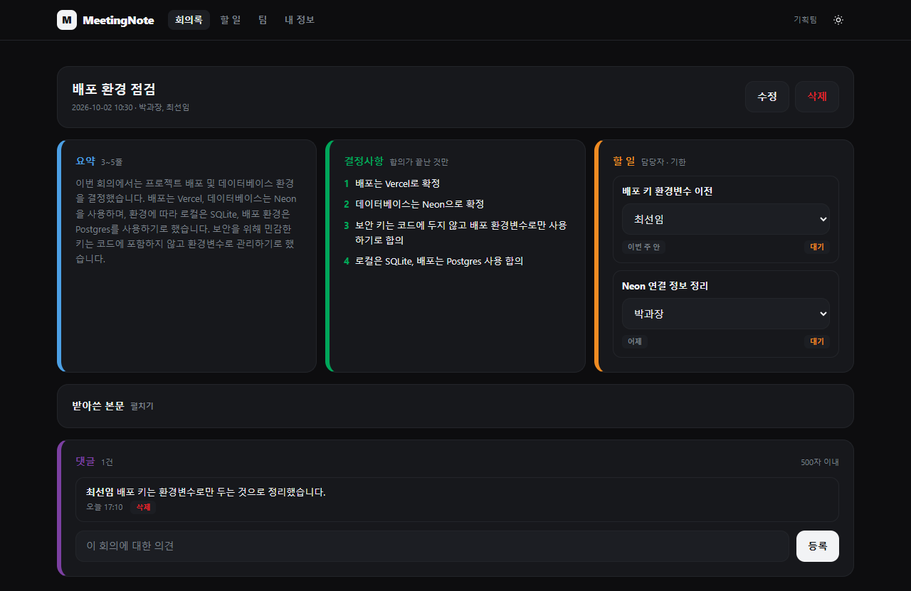 | 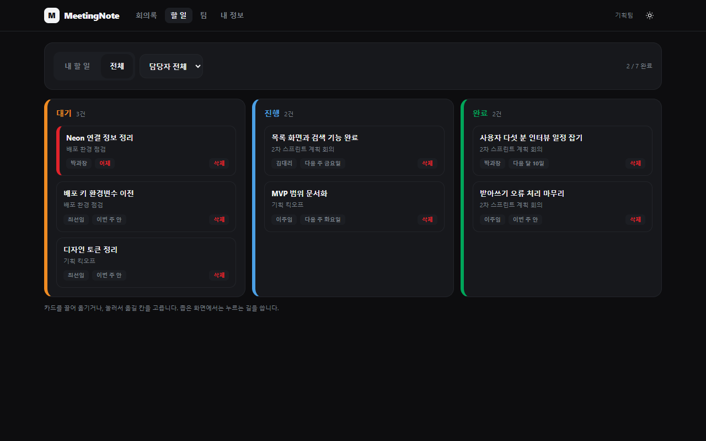 |

</details>

<details>
<summary><b>📱 360px 모바일</b> — 가로 스크롤 없이 카드가 한 열로 접힙니다</summary>
<br>

| 회의록 목록 | 할 일 칸반 | 회의록 상세 |
|:---:|:---:|:---:|
| 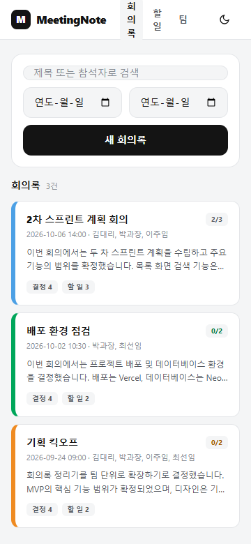 | 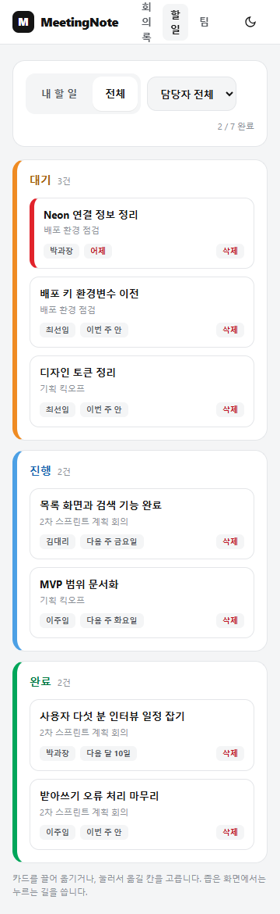 | 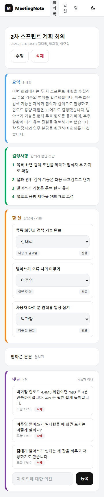 |

</details>

<details>
<summary><b>🔑 로그인 / 회원가입</b> · <b>📖 Swagger UI</b></summary>
<br>

| 로그인 | Swagger UI (`/docs`) |
|:---:|:---:|
| 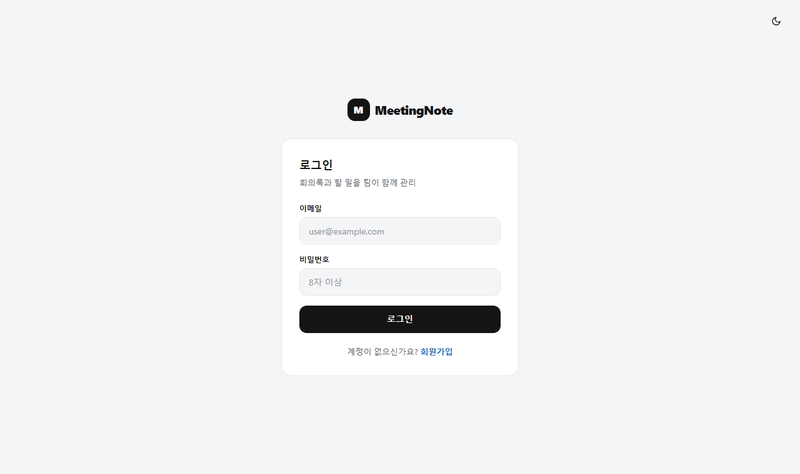 | 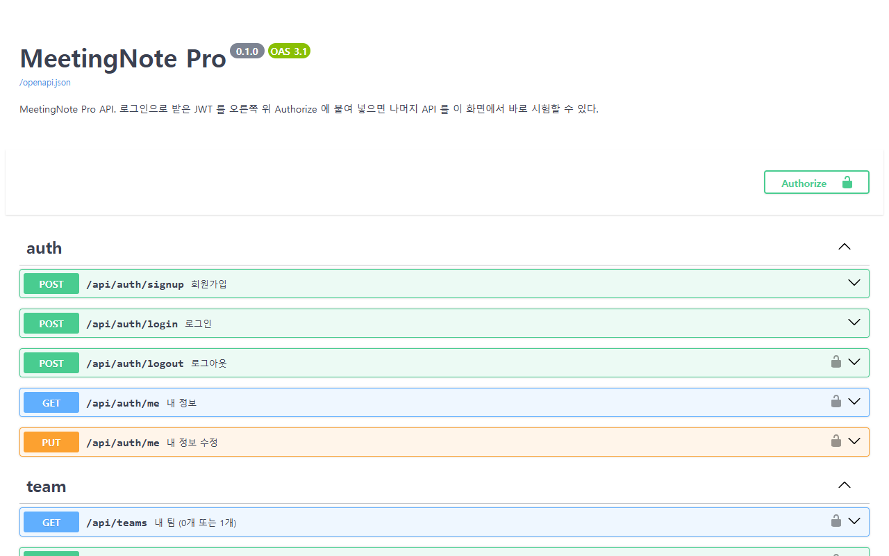 |

`/docs`에서 로그인으로 받은 JWT를 **Authorize**에 붙여 넣으면 API 26개를 화면에서 바로 시험할 수 있습니다.

</details>

<br>

## 🔄 사용 흐름

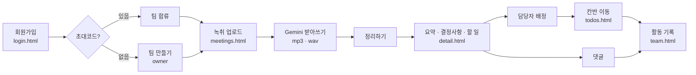

<br>

## 🧩 기능 상세

<details>
<summary><b>🔐 인증</b> — 가입 · 로그인 · 로그아웃 · 내 정보</summary>

- 비밀번호는 **bcrypt**로 해시, 로그인은 **JWT 24시간**(갱신 없음, 서버는 블랙리스트를 두지 않음)
- 로그인 실패는 *이메일이 없든 비밀번호가 틀리든* 같은 메시지(`INVALID_CREDENTIALS`)로 통일해 계정 존재 여부를 노출하지 않음
- 토큰이 만료되면 화면이 토큰을 지우고 로그인 화면에서 **세션 만료** 안내
- 비밀번호를 바꿀 때는 **현재 비밀번호 확인**이 필수
</details>

<details>
<summary><b>👥 팀</b> — 생성 · 합류 · 초대코드 · 멤버</summary>

- 초대코드는 팀마다 하나(`MN-XXXX`). owner만 **재발급**할 수 있고, 재발급하면 앞의 코드는 폐기(기존 멤버는 그대로)
- 한 사람은 한 팀에만 속하며 팀당 **6명**까지. 가입 중 초대코드가 틀려도 **계정은 유지**됨
- owner 전용 조작은 *팀 이름 변경 · 초대코드 재발급 · 할 일 삭제* 셋뿐 — member 화면은 해당 버튼이 비활성
- 다른 팀의 자원은 존재 여부를 숨기려고 **404**로 응답
</details>

<details>
<summary><b>🗒️ 회의록</b> — 업로드 · 받아쓰기 · 정리 · 검색</summary>

- 업로드는 확장자가 아니라 **파일 내용**(매직 바이트)으로 mp3/wav를 판정. 상한 **4.4MB**, 길이 제한 없음
- 저장하면 본문은 **그대로 보존**하고, Gemini가 세 항목으로 나눔. 정리가 실패해도 회의록은 저장됨(세 칸은 빈 값)
- 목록은 `met_at` 내림차순, 본문 없이 가볍게. 검색은 **제목과 참석자만**(본문은 대상 아님). 결과가 없으면 404가 아니라 `200 + 빈 배열`
- 수정·삭제는 올린 사람과 owner만. 삭제하면 딸린 할 일·댓글도 함께 삭제
</details>

<details>
<summary><b>📋 할 일</b> — 칸반 3열</summary>

- 할 일은 회의록 저장 때 만들어짐(따로 만드는 API 없음). 담당자가 회의에서 드러나지 않으면 **미정**
- 끌어서 놓는 순간 **한 번만** 호출하고 실패하면 카드가 원래 칸으로 돌아옴. 좁은 화면에서는 카드를 눌러 칸을 고름
- 완료도 지우지 않고 남겨 활동 기록의 근거로 씀. 삭제는 owner만
</details>

<details>
<summary><b>💬 댓글 · 📜 활동 기록</b></summary>

- 댓글 500자 이내. 지울 수 있는 사람(쓴 사람 · owner)은 서버가 `can_delete`로 판정해 내려 줌
- 활동 종류는 **5가지로 닫혀 있음**: `meeting_add` · `todo_assign` · `todo_done` · `comment_add` · `member_join`
- 문장은 서버가 완성해서 내려 주고 화면은 그대로 그림 (예: 「할 일 「배포 키 환경변수 이전」 완료」)
</details>

<br>

## 🏗️ 아키텍처

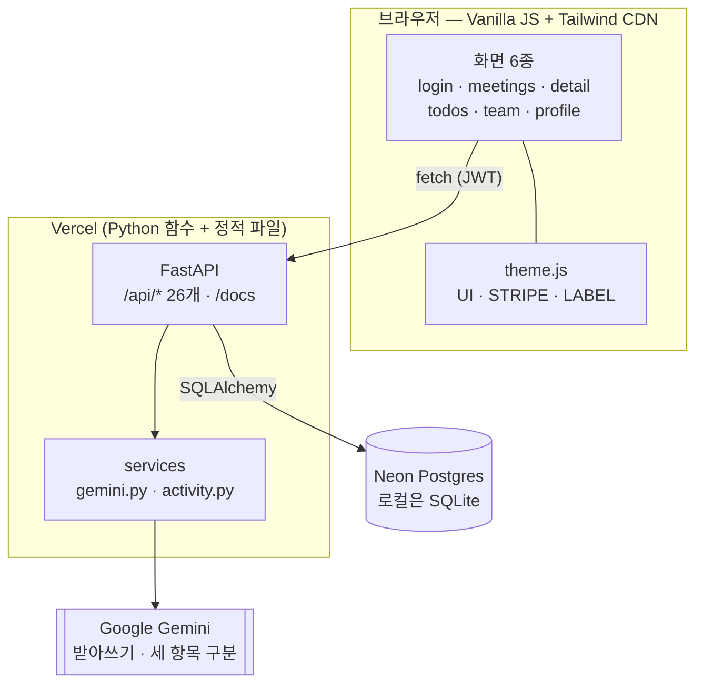

- **코드는 한 벌.** `DATABASE_URL`이 있으면 Postgres, 없으면 로컬 SQLite — 분기는 [`backend/app/db.py`](backend/app/db.py) 한 곳
- 로컬은 `uvicorn` 하나가 API와 정적 파일을 함께 내보냄. 정적 파일은 라우터 **뒤에** 연결해서 `/docs`가 가려지지 않음
- Gemini 호출은 [`backend/app/services/gemini.py`](backend/app/services/gemini.py) 한 곳에만 있고, 모델명과 키는 `.env`

<br>

## 🔌 API (26개)

모든 경로는 `/api/` 접두사. 오류는 항상 `{code, msg}` — 코드는 16개로 닫혀 있습니다.

| 그룹 | 메서드 · 경로 | 설명 |
|---|---|---|
| **Auth** (5) | `POST /api/auth/signup` · `POST /api/auth/login` | 가입(201 + JWT) · 로그인 |
| | `GET` · `PUT /api/auth/me` · `POST /api/auth/logout` | 내 정보 · 수정 · 로그아웃 |
| **Team** (6) | `POST` · `GET /api/teams` · `POST /api/teams/join` | 팀 만들기 · 내 팀 · 초대코드 합류 |
| | `GET /api/teams/{id}/members` | 멤버 + 할 일 수 |
| | `PUT /api/teams/{id}` · `PUT /api/teams/{id}/code` | 이름 변경 · 코드 재발급 (owner) |
| **Meeting** (6) | `POST` · `GET /api/teams/{id}/meetings` | 저장(+세 항목 구분) · 목록(`?q &from &to`) |
| | `GET` · `PUT` · `DELETE /api/meetings/{id}` | 상세 · 수정 · 삭제 |
| | `POST /api/upload` | 녹취 받아쓰기 (저장 안 함) |
| **Todo** (4) | `GET /api/teams/{id}/todos` · `GET /api/me/todos` | 팀 전체 · 내 할 일 |
| | `PUT` · `DELETE /api/todos/{id}` | 상태·담당자·기한 변경 · 삭제(owner) |
| **Comment** (3) | `POST` · `GET /api/meetings/{id}/comments` · `DELETE /api/comments/{id}` | 등록 · 목록 · 삭제 |
| **Activity** (2) | `GET /api/teams/{id}/activities` · `GET /api/me/activities` | 팀 활동 · 내 활동 (최근 50건) |

> `/docs` · `/openapi.json`은 문서용이라 26개에 포함하지 않습니다.

<details>
<summary><b>🗄️ DB 스키마 (7테이블)</b></summary>

```mermaid
erDiagram
    users ||--o{ memberships : "한 사람 한 팀"
    teams ||--o{ memberships : has
    teams ||--o{ meetings : has
    teams ||--o{ activities : has
    meetings ||--o{ todos : "cascade"
    meetings ||--o{ comments : "cascade"
    users ||--o{ comments : writes
    users ||--o{ activities : acts
    users |o--o{ todos : "assignee (미정 = null)"

    users { int id PK
            text email UK
            text password_hash
            text name }
    teams { int id PK
            text name
            text invite_code UK
            int owner_id FK }
    memberships { int team_id FK
                  int user_id FK_UK
                  text role "owner | member" }
    meetings { int id PK
               int team_id FK
               text title
               datetime met_at
               text attendees
               text body
               text summary
               text decisions "줄바꿈 구분"
               int author_id FK }
    todos { int id PK
            int meeting_id FK
            text what
            int assignee_id FK
            text due_text "자유 글자"
            text status "OPEN | DOING | DONE" }
    comments { int id PK
               int meeting_id FK
               int user_id FK
               text content }
    activities { int id PK
                 int team_id FK
                 int actor_id FK
                 text kind "5종"
                 text target }
```

</details>

<br>

## 🎨 디자인 시스템

색은 **좌측 6px 띠와 라벨 글자**에만 씁니다. 카드 배경은 언제나 무채색이라 한 화면에 색이 5%도 안 됩니다.

| 이름 | dot (띠·점) | text (흰 배경 글자) | 쓰임 |
|---|---|---|---|
| 🔵 blue | `#4CA0E5` | `#1565B0` | 요약 · 진행 중 |
| 🟢 green | `#00A65A` | `#007A42` | 결정사항 · 완료 |
| 🟠 orange | `#EF8B22` | `#A65A00` | 할 일 · 대기 |
| 🔴 red | `#E1232B` | `#C21620` | 오류 · 기한 지남 |
| 🟣 purple | `#7C40A2` | `#6B3590` | 팀 · 활동 기록 |

- 모든 화면이 [`frontend/theme.js`](frontend/theme.js) **한 파일**의 이름(`UI` · `STRIPE` · `LABEL`)만 가져다 씀 — 화면에서 클래스를 새로 조합하지 않음
- 버튼 높이 **44px 하나**, 모서리는 카드 `rounded-xl` · 패널 `rounded-2xl` 둘뿐, `!important` · 인라인 `style` 금지
- 이 규칙은 **테스트가 지킵니다** → [`test_frontend_rules.py`](backend/tests/test_frontend_rules.py)가 위반을 찾으면 실패

<br>

## 🚀 시작하기

### 준비물
Python 3.11+ · (선택) Node 18+ · (받아쓰기·정리를 쓰려면) [Gemini API 키](https://aistudio.google.com/apikey)

### 설치와 실행

```bash
git clone https://github.com/BulNim/meetingnote-pro.git
cd meetingnote-pro

pip install uv                    # 이미 있다면 건너뜀 (https://docs.astral.sh/uv/)
uv sync --extra dev               # .venv 를 만들고 pyproject 의 의존성을 설치

cp .env.example .env              # Windows: copy .env.example .env  →  GEMINI_API_KEY 에 키를 넣는다

uv run uvicorn app.main:app --app-dir backend --reload
```

→ http://127.0.0.1:8000 (로그인 화면) · http://127.0.0.1:8000/docs (Swagger UI)

처음 실행하면 `meetingnote.db`(SQLite)가 만들어집니다. 키가 없어도 가입·팀·칸반·댓글은 모두 동작하고, **받아쓰기와 자동 정리만** 502(`UPSTREAM_ERROR`)로 안내됩니다.

### 환경변수

| 이름 | 어디서 | 설명 |
|---|---|---|
| `GEMINI_API_KEY` | `.env` · Vercel | Gemini API 키 |
| `GEMINI_MODEL` | `.env` · Vercel | 모델 이름 (기본 `gemini-3.1-flash-lite`) |
| `JWT_SECRET` | Vercel | 서명 키. 로컬은 코드 기본값 |
| `DATABASE_URL` | Neon 통합이 주입 | 있으면 Postgres, 없으면 로컬 SQLite |

> `.env`는 `.gitignore`에 있어 저장소에 올라가지 않습니다. 키를 코드에 적지 마세요.

<br>

## 🧪 테스트

```bash
uv run pytest                      # 전체 103개 (실제 Gemini 4개 포함, 키가 없으면 건너뜀)
uv run pytest -m "not gemini"      # Gemini 를 부르지 않는 99개
uv run pytest -m gemini            # 실제 호출 시험만
```

| 구분 | 내용 |
|---|---|
| **API** | 인증 · 팀 · 회의록 · 할 일 · 댓글 · 활동의 정상/오류/권한 경계 (FastAPI `TestClient` + 임시 SQLite) |
| **실제 Gemini** | `회의_녹음.wav`(99.6초) 받아쓰기 → 세 항목 구분 → API 저장, mp3 업로드까지 |
| **디자인 규칙** | `style=` · `!important` · 44px 아닌 버튼 · 팔레트 밖 색 · `theme.js`가 `publish/`와 달라졌는지 |
| **회귀** | 빈 DB로 서버를 처음 띄우면 테이블 7개가 만들어지는지, 모든 화면 스크립트의 문법 |
| **API 표면** | OpenAPI에 정확히 26개 · 모두 `/api/` 접두사 |

**화면 시험(실제 서버 + 실제 Chrome, Playwright)** — pytest가 자동으로 돌리지 않는 사용자 시나리오입니다. 끌어서 옮기기, 세션 만료, member 권한, 정원 초과, 360px 가로 스크롤까지 재현합니다. → [`backend/tests/e2e_screens/`](backend/tests/e2e_screens/README.md)

<br>

## ☁️ 배포

Vercel CLI로 **GitHub 연동 없이** 배포했습니다.

```bash
vercel link --yes --project meetingnote-pro
vercel integration add neon --name meetingnote-db    # Neon DB 생성 + DATABASE_URL 주입
python backend/migrate.py                            # 테이블 7개 생성 (멱등)
vercel env add JWT_SECRET production --sensitive
vercel deploy --prod
```

- 진입점은 루트 [`index.py`](index.py) (Vercel 제로 설정이 `app`을 찾음), 불필요한 파일은 [`.vercelignore`](.vercelignore)
- ⚠️ **Vercel 함수는 요청 본문이 4.5MB를 넘으면 플랫폼이 직접 413을 돌려줍니다**(JSON이 아님). 실측으로 파일 약 4.49MB부터 막혀서, 서버 상한을 **4.4MB**로 두어 우리 코드가 먼저 `PAYLOAD_TOO_LARGE`를 돌려줍니다

<br>

## 📐 스펙 주도 개발 (OpenSpec)

이 프로젝트는 코드보다 **스펙을 먼저** 확정하고, 같은 입력에서 같은 산출물이 나오게 만들었습니다.

```
docs/*.pdf  (프로그램정의 · 스토리보드 · 디자인시스템)
    │   기획 자료 — 화면 6종 · 상태 62종 · API 26개 · DB 7테이블
    ▼
publish/*.html   확정 디자인 (색과 클래스 규칙의 기준)
    ▼
openspec  propose → specs 6개 + design + tasks 44개
    ▼
apply     작업 단위로 구현 + 테스트 (44/44)
    ▼
archive   주 스펙으로 동기화 → openspec/specs/
```

| 스펙 | 요구사항 | | 스펙 | 요구사항 |
|---|:---:|---|---|:---:|
| [`auth`](openspec/specs/auth/spec.md) | 11 | | [`meeting`](openspec/specs/meeting/spec.md) | 12 |
| [`team`](openspec/specs/team/spec.md) | 8 | | [`todo`](openspec/specs/todo/spec.md) | 8 |
| [`comment`](openspec/specs/comment/spec.md) | 3 | | [`activity`](openspec/specs/activity/spec.md) | 4 |

각 요구사항의 첫 줄에는 **근거가 된 스토리보드 ID와 퍼블리싱 파일**이 주석으로 남아 있어, 화면 ↔ 스펙 ↔ API를 따라갈 수 있습니다. 구현 이력은 [`openspec/changes/archive/`](openspec/changes/archive/2026-10-08-add-mvp-core/)에 있습니다.

<br>

## 📁 폴더 구조

```
meetingnote-pro/
├─ backend/
│  ├─ app/
│  │  ├─ main.py          앱 조립 · 정적 파일은 라우터 뒤에
│  │  ├─ config.py        환경설정 · 상수(업로드 4.4MB, 팀 6명 …)
│  │  ├─ db.py            DATABASE_URL 분기 (Postgres ↔ SQLite)
│  │  ├─ models.py        테이블 7개
│  │  ├─ security.py      bcrypt · JWT
│  │  ├─ deps.py          로그인 · 팀 접근 검사
│  │  ├─ errors.py        {code, msg} 16개 코드
│  │  ├─ routers/         auth · teams · meetings · todos · comments · activities
│  │  └─ services/        gemini.py · activity.py
│  ├─ migrate.py          테이블 생성 (Neon)
│  └─ tests/              pytest 103개 + e2e_screens/
├─ frontend/
│  ├─ theme.js            색 · 클래스 · 테마 (한 곳에서만 정의)
│  ├─ *.html              화면 6종
│  └─ js/                 app.js(공통) + 화면별 스크립트
├─ publish/               확정 디자인 (구현의 기준, 수정하지 않음)
├─ docs/                  기획 자료 · 결정기록 · 이슈보고 · screenshots/
├─ openspec/              specs/ (주 스펙) · changes/archive/
├─ index.py               Vercel 진입점
└─ pyproject.toml
```

<br>

## 🧭 설계 결정과 알려진 한계

자세한 근거는 [`docs/결정기록.md`](docs/결정기록.md)와 [`docs/이슈보고.md`](docs/이슈보고.md)에 있습니다.

- **업로드 25MB → 4.4MB** — Vercel 본문 한도 때문. mp3 128kbps로 약 4분 반, 22.05kHz 모노 wav로 약 1분 40초
- **받아쓰기 60초 규칙 폐기** — 길이를 재지 않고 용량만 봅니다
- **기한(`due_text`)은 자유 글자** — 서버는 날짜로 해석하지 않습니다. 화면은 `YYYY-MM-DD`일 때만 오늘과 비교하고 「어제 · 지난 주 · 지난 달」은 지난 기한으로 표시합니다. 날짜가 아닌 「다음 주 금요일」은 시간이 지나도 빨간 띠가 켜지지 않습니다 *(차후 논의)*
- **정리 실패 시에도 저장** — Gemini 호출이 실패해도 회의록은 저장되고 요약 · 결정사항 · 할 일만 비어 있습니다
- **알려진 한계** — 화면이 서버 응답을 받기 전(첫 1초 안팎)에 누르면 반응이 없을 수 있음 · 검색 기간은 UTC 날짜 기준 · 토큰 블랙리스트 없음(로그아웃해도 토큰은 24시간 유효)
- **퍼블리싱 규칙 위반을 구현에서 고침** — 확정 HTML에 있던 `h-10` 버튼, 복붙한 클래스, 인라인 `style`은 규칙대로 고쳤고 `publish/`는 그대로 둡니다

<br>

## 📚 문서

| 문서 | 내용 |
|---|---|
| [`docs/결정기록.md`](docs/결정기록.md) | 확정/기본안 결정 D-001 ~ D-028, 헤비 이슈 H-1 ~ H-5 |
| [`docs/이슈보고.md`](docs/이슈보고.md) | 원본과 구현이 달라진 곳 · 위험 · 기획 공백 (R-01 ~ R-20) |
| `docs/*.pdf` | 프로그램정의 · 스토리보드 · 디자인시스템 (기획 원본) |
| [`openspec/specs/`](openspec/specs/) | 6개 capability의 주 스펙 |

<br>

<div align="center">

**MeetingNote Pro** · AI-DLC 심화 with OpenSpec

</div>
