<div align="center">

# MeetingNote Pro

**로그인한 팀이 함께 쓰는 회의록**
녹취를 올리면 받아쓰고, 본문을 **요약 · 결정사항 · 할 일**로 나누고, 할 일은 **칸반**으로 추적하며, **댓글**과 **활동 기록**이 남습니다.


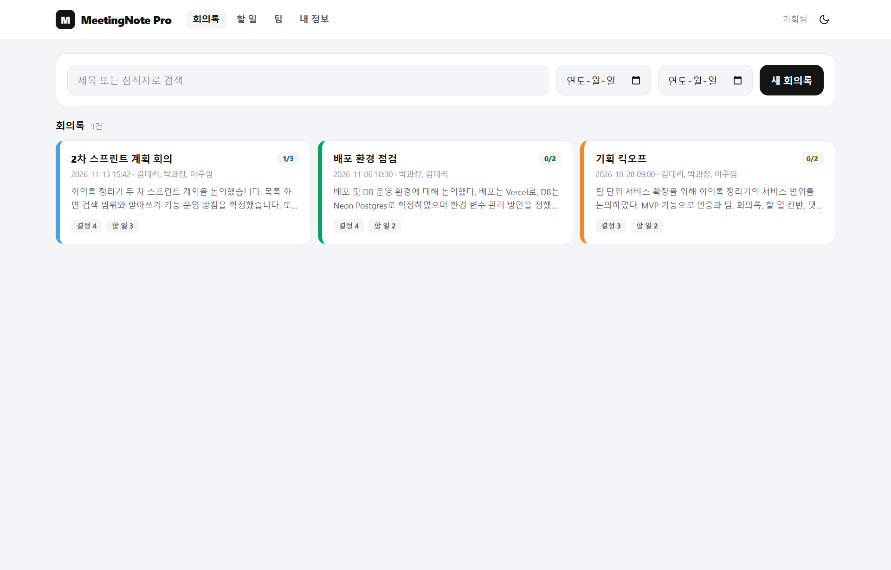

</div>

---

## 목차

1. [한눈에 보기](#1-한눈에-보기)
2. [화면](#2-화면)
3. [기능](#3-기능)
4. [사용 흐름](#4-사용-흐름)
5. [아키텍처](#5-아키텍처)
6. [데이터 흐름 - 녹취에서 칸반까지](#6-데이터-흐름---녹취에서-칸반까지)
7. [ER 다이어그램](#7-er-다이어그램)
8. [할 일 상태와 활동 기록](#8-할-일-상태와-활동-기록)
9. [권한](#9-권한)
10. [API](#10-api)
11. [디자인 시스템](#11-디자인-시스템)
12. [폴더 구조](#12-폴더-구조)
13. [실행하기](#13-실행하기)
14. [테스트](#14-테스트)
15. [배포](#15-배포)
16. [개발 방식 - OpenSpec](#16-개발-방식---openspec)
17. [범위 밖](#17-범위-밖)
18. [문서](#18-문서)

---

## 1. 한눈에 보기

| | |
|---|---|
| **미션** | 녹취를 받아쓴 본문이 요약 · 결정사항 · 할 일로 나뉘고, 할 일은 칸반으로 추적되며, 댓글과 활동 기록이 보존되는 팀 회의록 |
| **사용자** | 팀 리더(결정사항의 행방 추적) · 팀원(내 할 일만) · 신규 합류자(검색으로 지난 결정 찾기) |
| **규모** | API 27개 · DB 7테이블 · 화면 6종 · 스토리보드 상태 63개 |
| **스택** | FastAPI + SQLAlchemy · Vanilla JS + Tailwind CDN · Gemini · SQLite(로컬) / Neon Postgres(배포) |
| **품질** | pytest 40개 통과 · 엔드포인트 점검 75건 통과 · 실제 녹취 전사 시험 통과 · 360px · 다크 모드 확인 |

---

## 2. 화면

### 로그인 · 회원가입

| 로그인 | 회원가입 (초대코드 선택) |
|---|---|
| 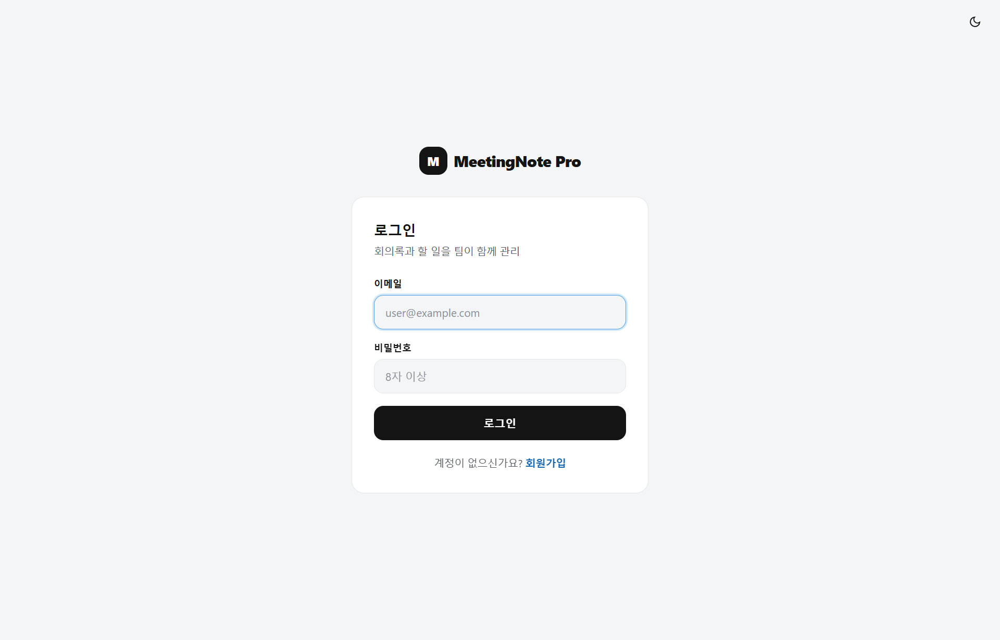 | 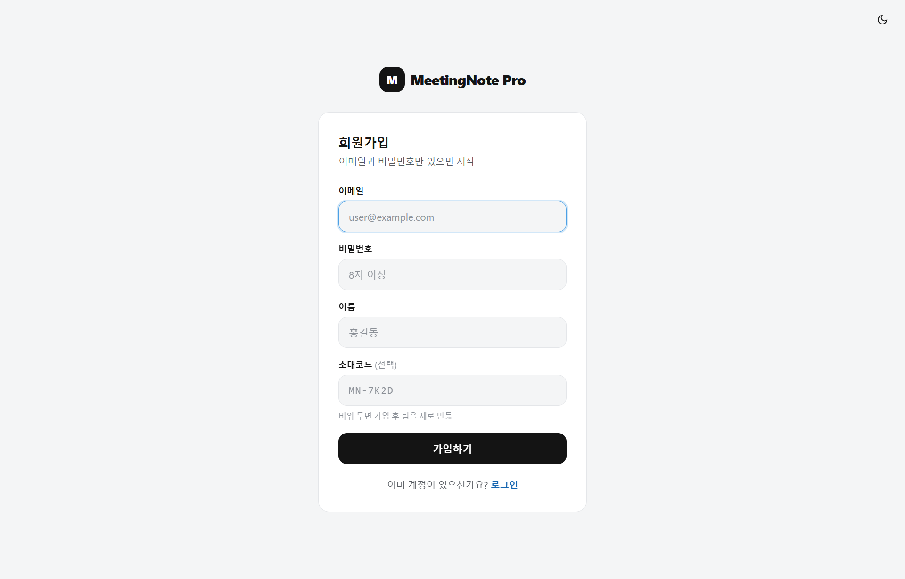 |

### 회의록 - 녹취를 끌어 놓으면 본문이 채워진다

| 목록 · 검색 | 새 회의록 - 받아쓰기 완료 |
|---|---|
|  | 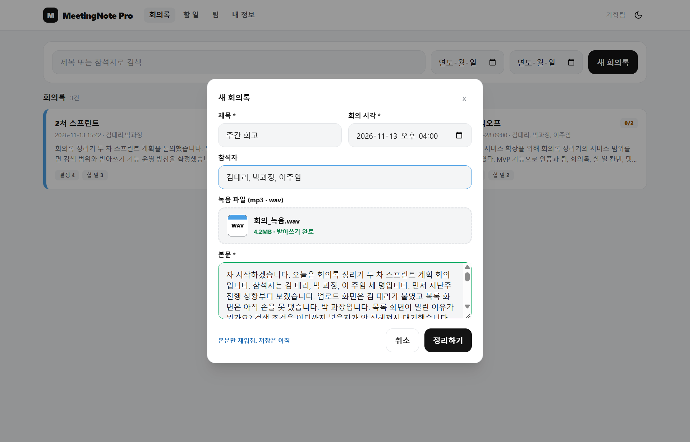 |

### 회의록 상세 - 요약 · 결정사항 · 할 일 3단 + 댓글

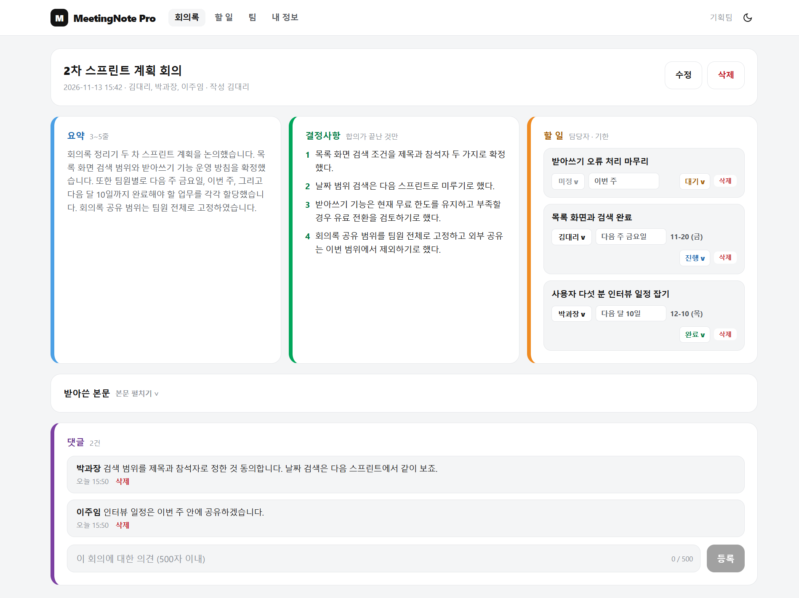

### 할 일 칸반 - 끌어서 옮기기 · 기한 지남은 붉은 띠

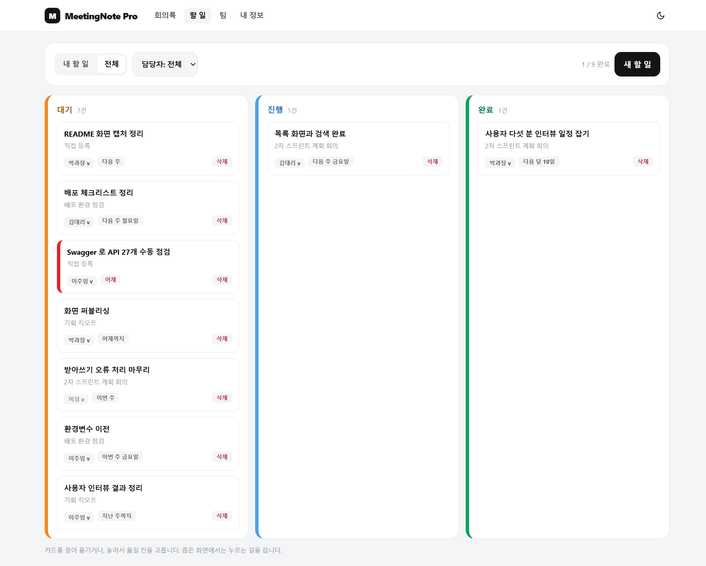

### 팀 설정 · 내 정보

| 팀 - 초대코드 · 멤버 · 활동 기록 | 내 정보 - 내 할 일 · 내 활동 |
|---|---|
| 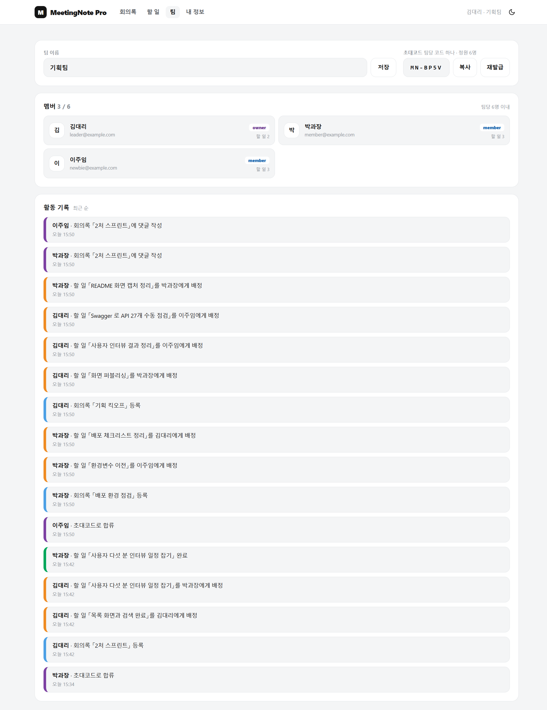 | 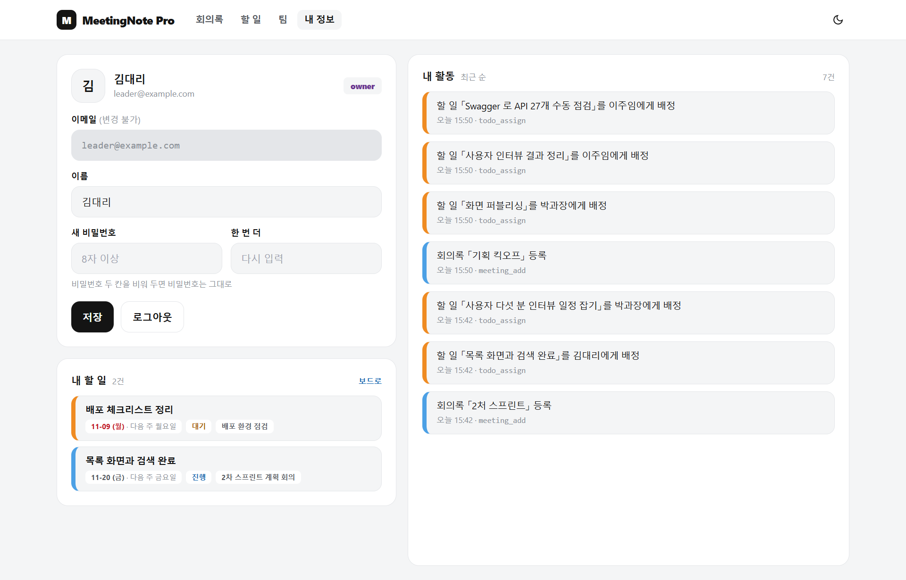 |

### 다크 모드

| 회의록 목록 | 회의록 상세 |
|---|---|
| 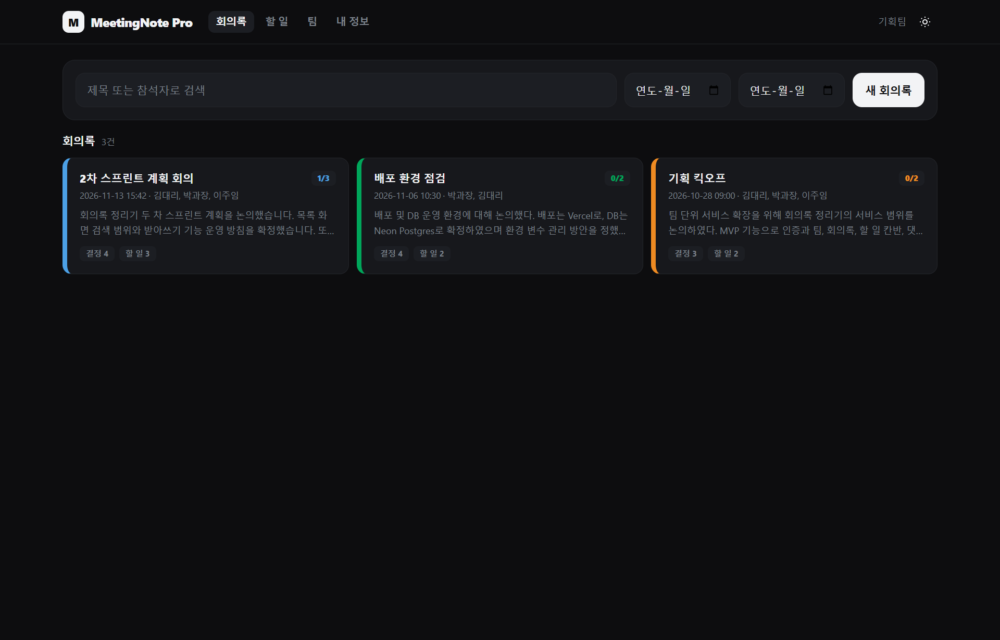 | 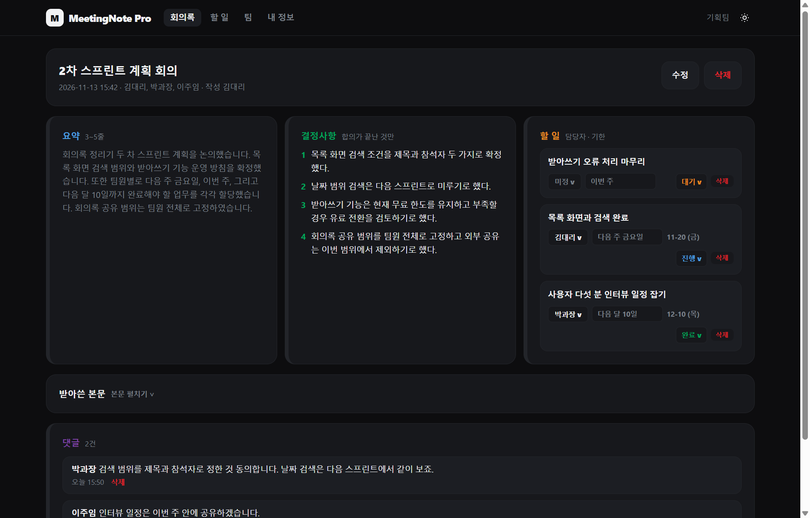 |

### 360px 화면 · Swagger UI

| 360px 목록 | 360px 칸 고르기 (끌 수 없는 화면) | Swagger UI `/docs` |
|---|---|---|
| 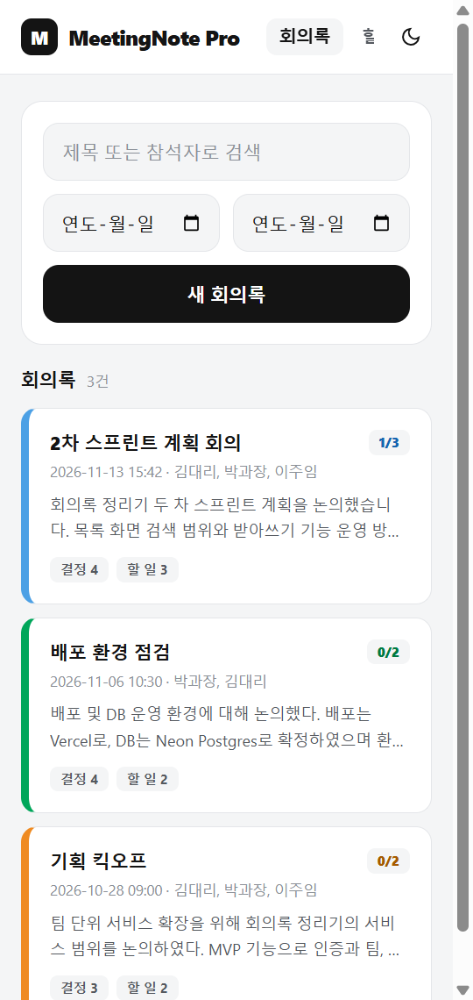 | 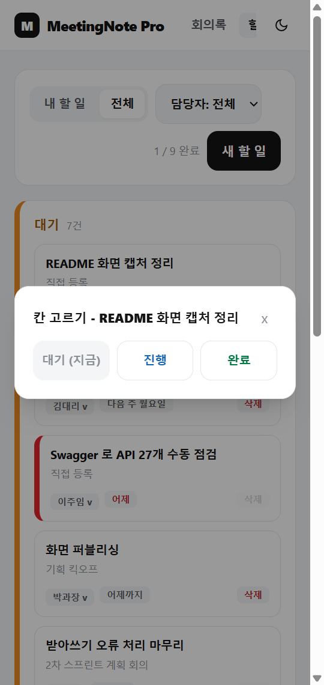 | 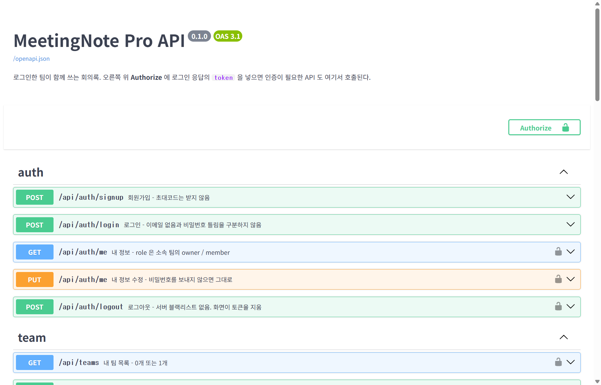 |

---

## 3. 기능

| # | 기능 | 하는 일 | API |
|---|---|---|---|
| 1 | **인증** | 회원가입 · 로그인 · JWT(24h, 갱신 없음) · bcrypt · 내 정보 수정 · 로그아웃 | 5 |
| 2 | **팀** | 팀 생성 · 초대코드(`MN-XXXX`) 발급과 재발급 · 합류 · 멤버 · 팀 이름. 한 사람 한 팀 · 6명 정원 | 6 |
| 3 | **회의록** | 녹취 업로드 · Gemini 받아쓰기 · 요약/결정사항/할 일 구분 · CRUD · 제목 · 참석자 검색 · 기간 | 6 |
| 4 | **할 일 칸반** | 대기 · 진행 · 완료 3열 · 포인터 끌기 · 눌러서 칸 고르기 · 담당자 배정 · 직접 등록 · 삭제 | 5 |
| 5 | **댓글** | 회의록에 의견 달기 (500자) · 목록 · 삭제 | 3 |
| 6 | **활동 기록** | 회의록 등록 · 할 일 배정과 완료 · 댓글 · 합류 5종을 팀 활동 · 내 활동으로 | 2 |

---

## 4. 사용 흐름

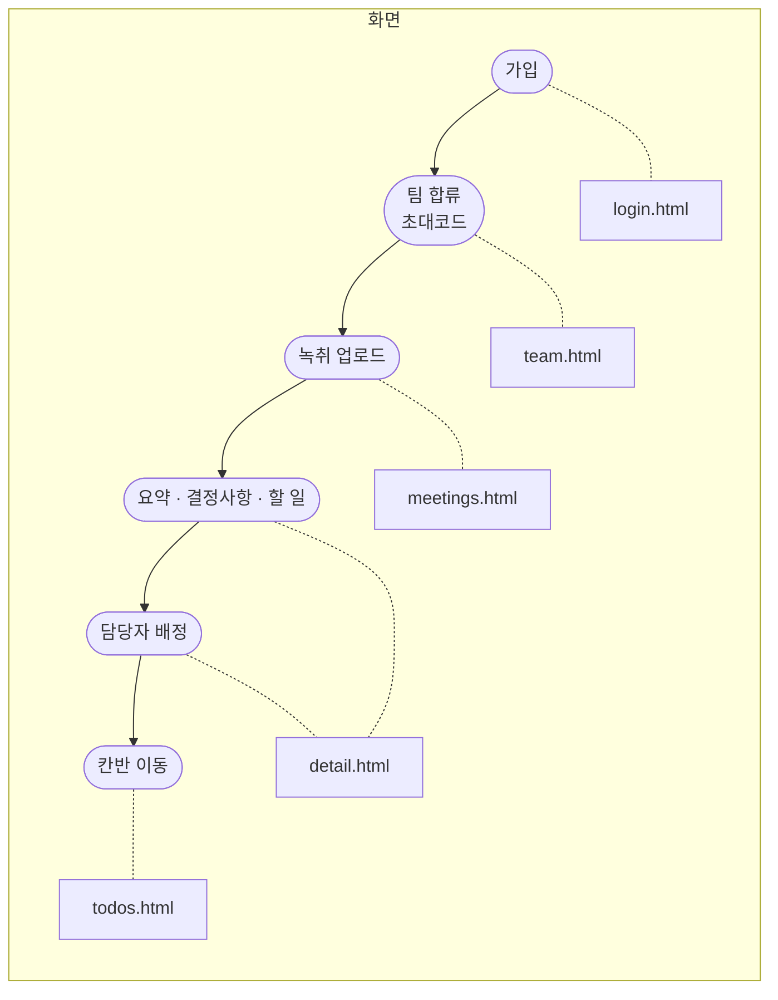
```mermaid
flowchart LR
    A([가입]) --> B([팀 합류<br/>초대코드])
    B --> C([녹취 업로드])
    C --> D([요약 · 결정사항 · 할 일])
    D --> E([담당자 배정])
    E --> F([칸반 이동])

    subgraph 화면
      A -.- L[login.html]
      B -.- T[team.html]
      C -.- M[meetings.html]
      D -.- DT[detail.html]
      E -.- DT
      F -.- TD[todos.html]
    end
```

| 페르소나 | 첫 화면 | 오래 머무는 화면 | 핵심 행동 |
|---|---|---|---|
| 팀 리더 | `meetings.html` | `detail.html` | 요약 · 결정사항 · 할 일 확인 후 배정 |
| 팀원 | `todos.html` | `todos.html` | 칸반에서 카드를 끌어 완료로 |
| 신규 합류자 | `team.html` | `meetings.html` | 검색으로 지난 결정 찾고 댓글로 질문 |

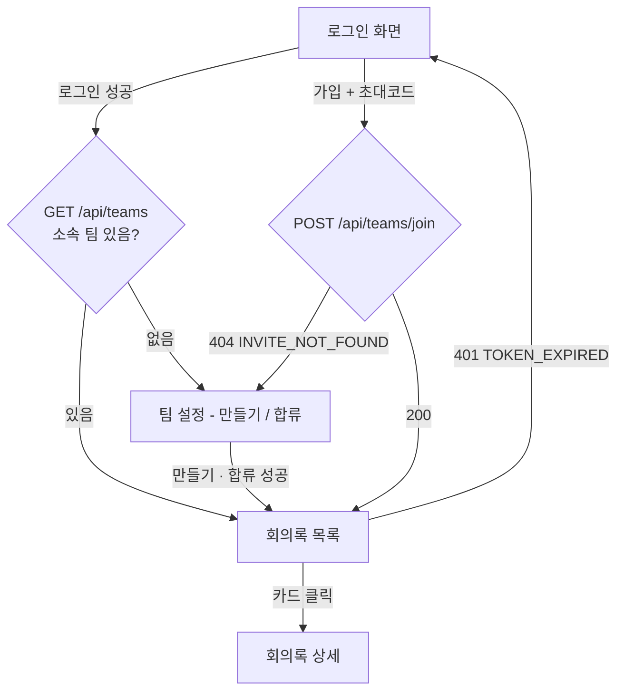
```mermaid
flowchart TD
    S[로그인 화면] -->|로그인 성공| G{GET /api/teams<br/>소속 팀 있음?}
    G -->|있음| MT[회의록 목록]
    G -->|없음| TM[팀 설정 - 만들기 / 합류]
    TM -->|만들기 · 합류 성공| MT
    S -->|가입 + 초대코드| J{POST /api/teams/join}
    J -->|200| MT
    J -->|404 INVITE_NOT_FOUND| TM
    MT -->|카드 클릭| DT[회의록 상세]
    MT -->|401 TOKEN_EXPIRED| S
```

---

## 5. 아키텍처

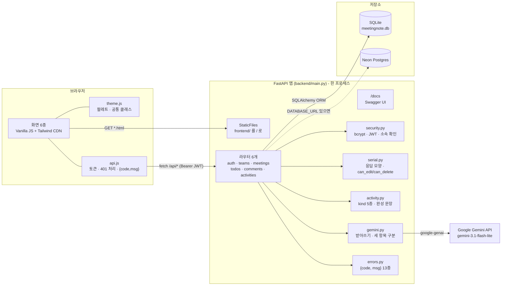
```mermaid
flowchart LR
    subgraph Browser["브라우저"]
      UI["화면 6종<br/>Vanilla JS + Tailwind CDN"]
      TH["theme.js<br/>팔레트 · 공통 클래스"]
      AJ["api.js<br/>토큰 · 401 처리 · {code,msg}"]
      UI --- TH
      UI --- AJ
    end

    subgraph App["FastAPI 앱 (backend/main.py) - 한 프로세스"]
      direction TB
      ST["StaticFiles<br/>frontend/ 를 / 로"]
      DOCS["/docs<br/>Swagger UI"]
      R["라우터 6개<br/>auth · teams · meetings<br/>todos · comments · activities"]
      SEC["security.py<br/>bcrypt · JWT · 소속 확인"]
      SER["serial.py<br/>응답 모양 · can_edit/can_delete"]
      ACT["activity.py<br/>kind 5종 · 완성 문장"]
      GEM["gemini.py<br/>받아쓰기 · 세 항목 구분"]
      ERR["errors.py<br/>{code, msg} 13종"]
      R --> SEC
      R --> SER
      R --> ACT
      R --> GEM
      R --> ERR
    end

    subgraph Data["저장소"]
      DB[("SQLite<br/>meetingnote.db")]
      PG[("Neon Postgres")]
    end

    G["Google Gemini API<br/>gemini-3.1-flash-lite"]

    AJ -- "fetch /api/* (Bearer JWT)" --> R
    UI -- "GET *.html" --> ST
    R -- "SQLAlchemy ORM" --> DB
    R -. "DATABASE_URL 있으면" .-> PG
    GEM -- "google-genai" --> G
```

**설계 원칙**

- **코드 한 벌, 환경 둘** - `DATABASE_URL` 이 있으면 Postgres, 없으면 SQLite. `VERCEL` 이 있으면 업로드 상한 4.5MB, 없으면 20MB.
- **한 곳에서만 정의** - 색과 클래스는 `theme.js`, 오류 코드는 `errors.py`, 권한 판정은 `serial.py` 의 함수 하나. 화면의 버튼 잠금(`can_delete`)과 서버의 403 이 같은 함수를 쓴다.
- **Gemini 는 바꿔 끼울 수 있게** - `gemini.py` 두 함수(`transcribe` · `classify`)만 외부를 부른다. 시험은 이 둘을 가짜로 바꿔 키 없이 돈다.
- **등록 순서** - API 라우터 → `/docs` → 정적 파일(`/`)을 맨 마지막에 붙여 `/docs` 와 `/api/*` 가 가려지지 않는다.

---

## 6. 데이터 흐름 - 녹취에서 칸반까지

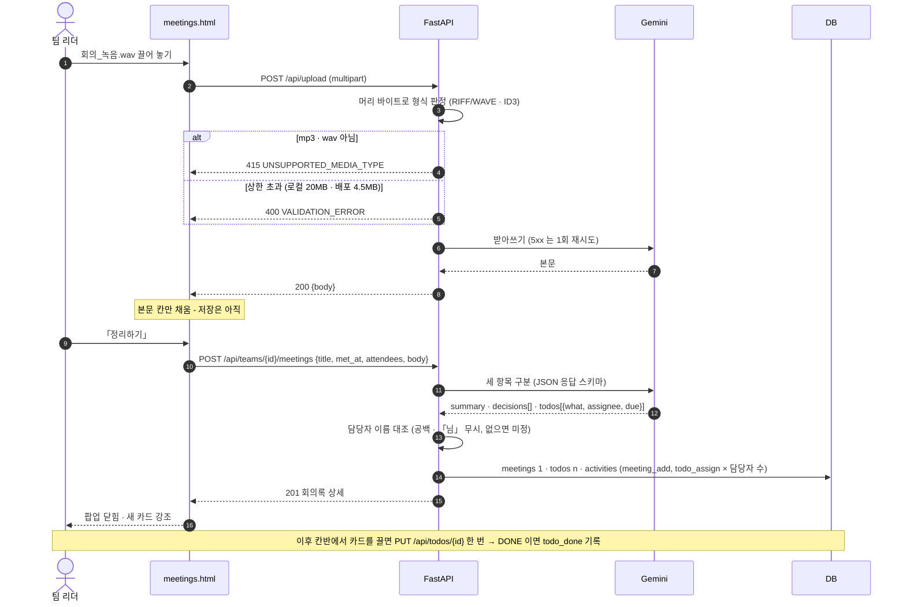
```mermaid
sequenceDiagram
    autonumber
    actor U as 팀 리더
    participant W as meetings.html
    participant A as FastAPI
    participant G as Gemini
    participant D as DB

    U->>W: 회의_녹음.wav 끌어 놓기
    W->>A: POST /api/upload (multipart)
    A->>A: 머리 바이트로 형식 판정 (RIFF/WAVE · ID3)
    alt mp3 · wav 아님
        A-->>W: 415 UNSUPPORTED_MEDIA_TYPE
    else 상한 초과 (로컬 20MB · 배포 4.5MB)
        A-->>W: 400 VALIDATION_ERROR
    end
    A->>G: 받아쓰기 (5xx 는 1회 재시도)
    G-->>A: 본문
    A-->>W: 200 {body}
    Note over W: 본문 칸만 채움 - 저장은 아직

    U->>W: 「정리하기」
    W->>A: POST /api/teams/{id}/meetings {title, met_at, attendees, body}
    A->>G: 세 항목 구분 (JSON 응답 스키마)
    G-->>A: summary · decisions[] · todos[{what, assignee, due}]
    A->>A: 담당자 이름 대조 (공백 · 「님」 무시, 없으면 미정)
    A->>D: meetings 1 · todos n · activities (meeting_add, todo_assign × 담당자 수)
    A-->>W: 201 회의록 상세
    W-->>U: 팝업 닫힘 · 새 카드 강조

    Note over U,D: 이후 칸반에서 카드를 끌면 PUT /api/todos/{id} 한 번 → DONE 이면 todo_done 기록
```

**세 항목 구분 규칙** (정의서 7-3)

| 항목 | 규칙 |
|---|---|
| 요약 | 회의 전체를 3~5줄. 없는 사실을 보태지 않음 |
| 결정사항 | 합의가 끝난 것만 (「하기로 했다 · 확정 · 승인」). 논의만 한 것은 넣지 않음 |
| 할 일 | 담당자나 기한이 드러난 것만. 담당자가 멤버와 맞지 않으면 미정 - 지어내지 않음 |
| 본문 수정 | 사람이 본문을 고쳐도 다시 돌리지 않음 |
| 구분 실패 | 저장하지 않고 502. 본문은 화면 칸에 남아 다시 저장 가능 |

---

## 7. ER 다이어그램

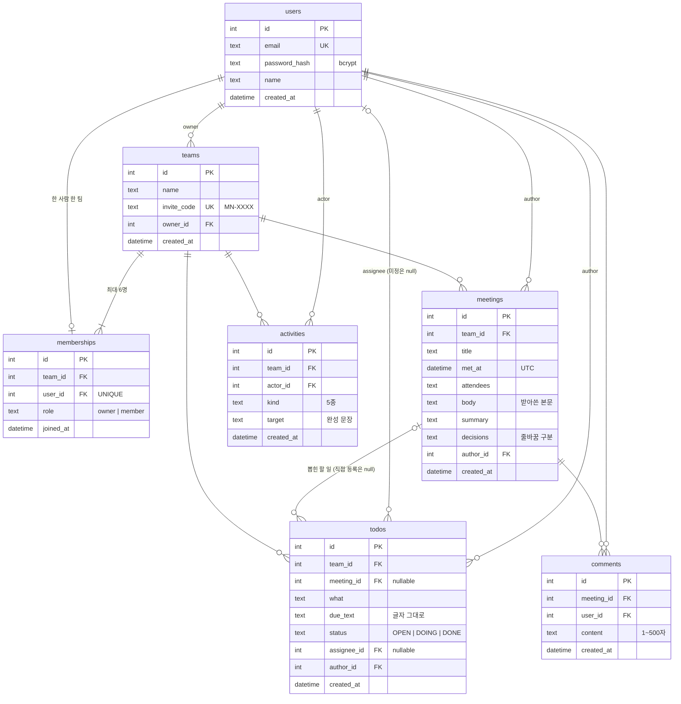
```mermaid
erDiagram
    users ||--o| memberships : "한 사람 한 팀"
    teams ||--|{ memberships : "최대 6명"
    users ||--o{ teams : "owner"
    teams ||--o{ meetings : ""
    users ||--o{ meetings : "author"
    teams ||--o{ todos : ""
    meetings |o--o{ todos : "뽑힌 할 일 (직접 등록은 null)"
    users |o--o{ todos : "assignee (미정은 null)"
    users ||--o{ todos : "author"
    meetings ||--o{ comments : ""
    users ||--o{ comments : ""
    teams ||--o{ activities : ""
    users ||--o{ activities : "actor"

    users {
        int id PK
        text email UK
        text password_hash "bcrypt"
        text name
        datetime created_at
    }
    teams {
        int id PK
        text name
        text invite_code UK "MN-XXXX"
        int owner_id FK
        datetime created_at
    }
    memberships {
        int id PK
        int team_id FK
        int user_id FK "UNIQUE"
        text role "owner | member"
        datetime joined_at
    }
    meetings {
        int id PK
        int team_id FK
        text title
        datetime met_at "UTC"
        text attendees
        text body "받아쓴 본문"
        text summary
        text decisions "줄바꿈 구분"
        int author_id FK
        datetime created_at
    }
    todos {
        int id PK
        int team_id FK
        int meeting_id FK "nullable"
        text what
        text due_text "글자 그대로"
        text status "OPEN | DOING | DONE"
        int assignee_id FK "nullable"
        int author_id FK
        datetime created_at
    }
    comments {
        int id PK
        int meeting_id FK
        int user_id FK
        text content "1~500자"
        datetime created_at
    }
    activities {
        int id PK
        int team_id FK
        int actor_id FK
        text kind "5종"
        text target "완성 문장"
        datetime created_at
    }
```

---

## 8. 할 일 상태와 활동 기록

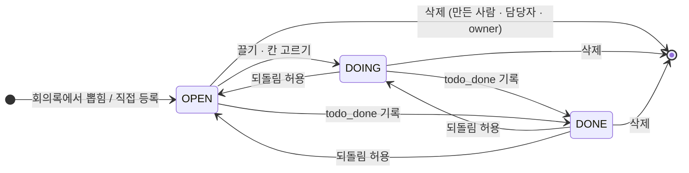
```mermaid
stateDiagram-v2
    direction LR
    [*] --> OPEN : 회의록에서 뽑힘 / 직접 등록
    OPEN --> DOING : 끌기 · 칸 고르기
    DOING --> DONE : todo_done 기록
    OPEN --> DONE : todo_done 기록
    DONE --> DOING : 되돌림 허용
    DONE --> OPEN : 되돌림 허용
    DOING --> OPEN : 되돌림 허용
    OPEN --> [*] : 삭제 (만든 사람 · 담당자 · owner)
    DOING --> [*] : 삭제
    DONE --> [*] : 삭제
```

| kind | 언제 | 화면 문장 예시 | 띠 색 |
|---|---|---|---|
| `meeting_add` | 회의록 저장 | 회의록 「2차 스프린트 계획 회의」 등록 | 🔵 blue |
| `todo_assign` | 담당자가 붙음 (저장 때 포함) | 할 일 「목록 정리」를 박과장에게 배정 | 🟠 orange |
| `todo_done` | DONE 이 됨 | 할 일 「목록 정리」 완료 | 🟢 green |
| `comment_add` | 댓글 등록 | 회의록 「…」에 댓글 작성 | 🟣 purple |
| `member_join` | 초대코드로 합류 | 초대코드로 합류 | 🟣 purple |

> 팀 생성 · 계정 변경 · 진행(DOING) 이동 · 삭제는 기록하지 않는다. 활동은 최근 50건까지 보여 준다.

**기한 지남** - 서버는 판정하지 않는다. 화면이 `due_text` 가 「어제 · 지난 주 · 지난 달」인 미완료 카드에만 붉은 띠를 붙인다.

---

## 9. 권한

| 대상 | 읽기 | 수정 | 삭제 |
|---|---|---|---|
| 회의록 | 팀원 | 작성자 · owner | 작성자 · owner (딸린 할 일 · 댓글 함께) |
| 할 일 | 팀원 | 팀원 누구나 (상태 · 담당자 · 기한) | 만든 사람 · 담당자 · owner |
| 댓글 | 팀원 | - | 쓴 사람 · owner |
| 팀 이름 · 초대코드 재발급 | 팀원 | owner 만 (`403 OWNER_ONLY`) | - |
| 다른 팀 자료 | `403 FORBIDDEN` · 회의록 단건은 `404 MEETING_NOT_FOUND` (존재를 드러내지 않음) | | |

---

## 10. API

모든 경로는 `/api/` 로 시작하고, 인증은 `Authorization: Bearer <token>`. 오류 본문은 항상 `{code, msg}` 다.
**전체 명세** - [`reports/API_명세서.docx`](reports/API_명세서.docx) (39쪽, 요청 · 응답 예시 포함) · 실행 중이면 `http://127.0.0.1:8000/docs`

<details>
<summary><b>27개 엔드포인트 펼치기</b></summary>

| 묶음 | 메서드 | 경로 | 기능 |
|---|---|---|---|
| Auth | `POST` | `/api/auth/signup` | 회원가입 → `{token, user}` |
| Auth | `POST` | `/api/auth/login` | 로그인 → `{token, user}` |
| Auth | `GET` | `/api/auth/me` | 내 정보 (+ role) |
| Auth | `PUT` | `/api/auth/me` | 이름 · 비밀번호 변경 |
| Auth | `POST` | `/api/auth/logout` | 로그아웃 |
| Team | `POST` | `/api/teams` | 팀 생성 (owner) |
| Team | `GET` | `/api/teams` | 내 팀 (0 또는 1개) |
| Team | `POST` | `/api/teams/join` | 초대코드로 합류 |
| Team | `GET` | `/api/teams/{id}/members` | 멤버 + todo_count |
| Team | `PUT` | `/api/teams/{id}/code` | 초대코드 재발급 (owner) |
| Team | `PUT` | `/api/teams/{id}` | 팀 이름 변경 (owner) |
| Meeting | `POST` | `/api/teams/{id}/meetings` | 저장 + 세 항목 구분 |
| Meeting | `GET` | `/api/teams/{id}/meetings` | 목록 · `?q=&from=&to=` |
| Meeting | `GET` | `/api/meetings/{id}` | 단건 (body · todos · can_edit) |
| Meeting | `PUT` | `/api/meetings/{id}` | 수정 (작성자 · owner) |
| Meeting | `DELETE` | `/api/meetings/{id}` | 삭제 (할 일 · 댓글 함께) |
| Meeting | `POST` | `/api/upload` | 녹취 업로드 → `{body}` |
| Todo | `GET` | `/api/teams/{id}/todos` | 팀 할 일 |
| Todo | `POST` | `/api/teams/{id}/todos` | 직접 등록 |
| Todo | `PUT` | `/api/todos/{id}` | 상태 · 담당자 · 기한 |
| Todo | `GET` | `/api/me/todos` | 내 할 일 |
| Todo | `DELETE` | `/api/todos/{id}` | 삭제 |
| Comment | `POST` | `/api/meetings/{id}/comments` | 댓글 등록 |
| Comment | `GET` | `/api/meetings/{id}/comments` | 댓글 목록 |
| Comment | `DELETE` | `/api/comments/{id}` | 댓글 삭제 |
| Activity | `GET` | `/api/teams/{id}/activities` | 팀 활동 (50건) |
| Activity | `GET` | `/api/me/activities` | 내 활동 (50건) |

</details>

<details>
<summary><b>오류 코드 13종</b></summary>

| code | 상태 | 언제 |
|---|---|---|
| `EMAIL_INVALID` | 400 | 이메일 형식 |
| `PASSWORD_TOO_WEAK` | 400 | 비밀번호 8자 미만 |
| `VALIDATION_ERROR` | 400 / 502 | 입력 오류 · 이미 소속 · 상한 초과 / 받아쓰기 · 구분 실패 · 키 없음 |
| `INVALID_CREDENTIALS` | 401 | 로그인 실패 (이메일 없음과 구분 안 함) |
| `TOKEN_EXPIRED` | 401 | 토큰 없음 · 위조 · 24h 만료 |
| `FORBIDDEN` | 403 | 권한 모자람 · 다른 팀 |
| `OWNER_ONLY` | 403 | owner 전용 기능 |
| `INVITE_NOT_FOUND` | 404 | 없는 초대코드 |
| `MEETING_NOT_FOUND` | 404 | 없거나 다른 팀의 회의록 |
| `NOT_FOUND` | 404 | 없는 할 일 · 댓글 · 경로 |
| `EMAIL_DUPLICATED` | 409 | 이미 가입된 이메일 |
| `TEAM_FULL` | 409 | 6명 초과 |
| `UNSUPPORTED_MEDIA_TYPE` | 415 | mp3 · wav 아님 |

</details>

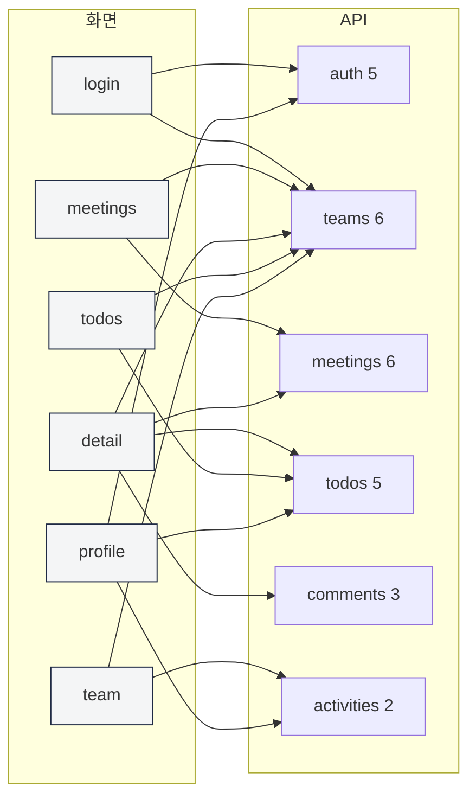
```mermaid
flowchart LR
    subgraph 화면
      LG[login]:::s
      MT[meetings]:::s
      DT[detail]:::s
      TD[todos]:::s
      TM[team]:::s
      PF[profile]:::s
    end
    subgraph API
      AU[auth 5]
      TE[teams 6]
      ME[meetings 6]
      TO[todos 5]
      CO[comments 3]
      AC[activities 2]
    end
    LG --> AU & TE
    MT --> TE & ME
    DT --> ME & TO & CO & TE
    TD --> TO & TE
    TM --> TE & AC
    PF --> AU & TO & AC
    classDef s fill:#f4f5f6,stroke:#1f2a44
```

---

## 11. 디자인 시스템

색과 클래스는 [`frontend/theme.js`](frontend/theme.js) 한 곳에서만 정의하고, 화면은 이름(`window.UI.btnPrimary` · `STRIPE` · `LABEL`)으로 가져다 쓴다. 확정 디자인은 [`publish/`](publish/) 에 있다.

| 이름 | dot (띠 · 점) | text (흰 배경 글자) | 쓰임 |
|---|---|---|---|
| blue | `#4CA0E5` | `#1565B0` | 요약 · 진행 |
| green | `#00A65A` | `#007A42` | 결정사항 · 완료 |
| orange | `#EF8B22` | `#A65A00` | 할 일 · 대기 |
| red | `#E1232B` | `#C21620` | 오류 · 기한 지남 |
| purple | `#7C40A2` | `#6B3590` | 팀 · 활동 기록 |

- **면적 규칙** - 카드 배경은 늘 무채색, 색은 좌측 6px 띠와 라벨 글자에만
- **버튼 높이** 44px(`h-11`) 하나 · **모서리** 카드 `rounded-xl` · 패널 `rounded-2xl` 둘뿐
- **금지** - `!important` · 인라인 style(진행 막대 width 만 예외) · 새 색 · 새 모서리 값 · 화면에서 새 클래스 조합
- **끌기** - 포인터 이벤트로 구현 (HTML5 draggable 은 터치에서 안 됨). 좁은 화면은 눌러서 칸 고르기

---

## 12. 폴더 구조

```
meetingnote-pro/
├── backend/                  FastAPI
│   ├── main.py               앱 · 라우터 등록 · /docs · 정적 파일
│   ├── config.py             .env 읽기 · 상수 (JWT 24h · 상한 · 정원)
│   ├── db.py                 SQLite ↔ Postgres 전환
│   ├── models.py             7테이블
│   ├── errors.py             {code, msg} 13종
│   ├── security.py           bcrypt · JWT · 소속 확인
│   ├── serial.py             응답 모양 · 권한 판정
│   ├── activity.py           활동 kind 5종
│   ├── gemini.py             받아쓰기 · 세 항목 구분
│   └── routers/              auth · teams · meetings · todos · comments · activities
├── frontend/                 Vanilla JS + Tailwind CDN
│   ├── theme.js  api.js
│   └── login · meetings · detail · todos · team · profile .html
├── tests/                    pytest 40개 (실제 Gemini 시험 1개 포함)
├── publish/                  확정 디자인 (퍼블리싱 원본)
├── docs/                     정의서 · 스토리보드 · 디자인시스템 PDF · screenshots/
├── reports/                  테스트 결과 보고서 · API 명세서 (docx)
├── openspec/                 specs/ (main spec 6개) · changes/archive/
├── .env.example              GEMINI_API_KEY · GEMINI_MODEL
├── requirements.txt  pyproject.toml  vercel.json  .vercelignore
└── README.md
```

---

## 13. 실행하기

```bash
# 1) 가상환경과 패키지
python -m venv .venv
.venv\Scripts\activate            # macOS · Linux: source .venv/bin/activate
pip install -r requirements.txt

# 2) 키 - 프로젝트 루트의 .env (두 줄뿐)
copy .env.example .env            # macOS · Linux: cp .env.example .env
#   GEMINI_API_KEY=발급받은 키
#   GEMINI_MODEL=gemini-3.1-flash-lite

# 3) 서버
uvicorn backend.main:app --reload
```

| 주소 | 내용 |
|---|---|
| http://127.0.0.1:8000 | 화면 (`/login.html` 로 이동) |
| http://127.0.0.1:8000/docs | Swagger UI - 오른쪽 위 **Authorize** 에 로그인 응답의 `token` 을 넣으면 인증 API 도 바로 호출 |

> 키가 없어도 서버와 화면은 돈다. 업로드 · 회의록 저장만 `502 VALIDATION_ERROR` 가 나고, 본문을 직접 붙여넣는 길은 열려 있다.

---

## 14. 테스트

```bash
python -m pytest            # 40 passed
```

| 파일 | 개수 | 내용 |
|---|---|---|
| `test_auth.py` | 8 | 가입 · 로그인 · 토큰 만료 · 내 정보 · 오류 본문 · /docs |
| `test_team.py` | 8 | 생성 · 합류 · 정원 · 재발급 · owner 전용 |
| `test_meeting.py` | 12 | 목록 · 검색 · 업로드 형식과 상한 · 502 · 담당자 대조 · 권한 · 연쇄 삭제 |
| `test_todo.py` | 6 | 상태 · 담당자 · can_delete 와 403 일치 · 정렬 |
| `test_comment_activity.py` | 5 | 댓글 권한 · 500자 · kind 5종 · 50건 |
| `test_gemini_live.py` | 1 | `회의_녹음.wav` 실제 전사 (키 없으면 skip) |

- Gemini 는 실제 시험 1개를 빼고 가짜로 바꿔 돌린다 - 키 · 네트워크 없이 39개가 돈다
- 엔드포인트 27개 × 정상 · 오류 75건 점검 결과는 [`reports/백엔드_엔드포인트_테스트_보고서.docx`](reports/백엔드_엔드포인트_테스트_보고서.docx)
- 브라우저: 사용 시나리오 4종 · 360px 가로 넘침 없음 · 라이트/다크 6개 화면 확인

---

## 15. 배포

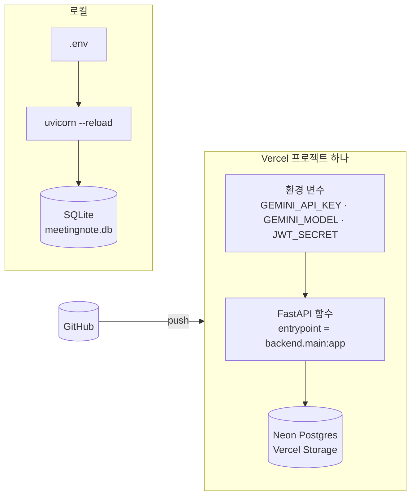
```mermaid
flowchart LR
    subgraph Local["로컬"]
      U1[uvicorn --reload] --> S1[(SQLite<br/>meetingnote.db)]
      E1[.env] --> U1
    end
    subgraph Vercel["Vercel 프로젝트 하나"]
      F["FastAPI 함수<br/>entrypoint = backend.main:app"] --> N[(Neon Postgres<br/>Vercel Storage)]
      EV["환경 변수<br/>GEMINI_API_KEY · GEMINI_MODEL · JWT_SECRET"] --> F
    end
    Git[(GitHub)] -->|push| Vercel
```

| | 로컬 | 배포 |
|---|---|---|
| 실행 | `uvicorn backend.main:app --reload` | `vercel.json` `{"framework": "fastapi"}` · `pyproject.toml` `[tool.vercel] entrypoint` |
| DB | SQLite 파일 | Neon Postgres (`DATABASE_URL` 자동 주입) |
| 키 | `.env` | Vercel 환경 변수 (+ `JWT_SECRET`) |
| 업로드 상한 | 20MB (초과분은 Gemini Files API) | 4.5MB (Vercel 요청 본문 한도) |

1. Vercel 에서 이 저장소를 가져온다
2. Storage → Neon 연결 (`DATABASE_URL` 이 자동으로 들어간다)
3. 환경 변수 `GEMINI_API_KEY` · `GEMINI_MODEL` · `JWT_SECRET` 등록 → 배포

> SQLite 는 배포 환경에서 쓰지 않는다 - 요청마다 새 환경이라 파일이 남지 않는다.

---

## 16. 개발 방식 - OpenSpec

이 프로젝트는 [OpenSpec](https://github.com/Fission-AI/OpenSpec) 의 spec-driven 흐름으로 만들었다. 정의서 · 스토리보드 · 퍼블리싱을 입력으로 change 하나(`add-mvp-core`)를 제안하고, 구현하고, main spec 으로 합쳤다.

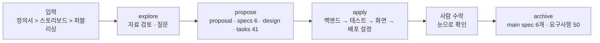
```mermaid
flowchart LR
    I["입력<br/>정의서 > 스토리보드 > 퍼블리싱"] --> X[explore<br/>자료 검토 · 질문]
    X --> P[propose<br/>proposal · specs 6 · design · tasks 41]
    P --> A[apply<br/>백엔드 → 테스트 → 화면 → 배포 설정]
    A --> H[사람 수락<br/>눈으로 확인]
    H --> R[archive<br/>main spec 6개 · 요구사항 50]
```

| 산출물 | 위치 |
|---|---|
| main spec (auth 13 · team 9 · meeting 12 · todo 9 · comment 3 · activity 4) | [`openspec/specs/`](openspec/specs/) |
| 아카이브된 change (proposal · design · tasks) | [`openspec/changes/archive/2026-11-13-add-mvp-core/`](openspec/changes/archive/2026-11-13-add-mvp-core/) |
| 요구사항마다 근거 | `<!-- 근거: B-02 · login.html -->` 처럼 스토리보드 ID 와 화면 파일 |

---

## 17. 범위 밖

1회차에서 **안 만들기로 한 것**이다 (정의서 4).

| 항목 | 이번 범위 |
|---|---|
| 실시간 녹음 | 파일 업로드만 |
| 화자 자동 구분 | 본문은 단일 블록 |
| 외부 연동 | 캘린더 · 메일 없음 |
| 권한 등급 | owner / member 둘뿐 |
| 푸시 알림 | 활동 기록 화면 표시까지 |
| 배포 환경 대용량 업로드 | 4.5MB 까지 (Blob 직접 업로드 없음) |

---

## 18. 문서

| 문서 | 내용 |
|---|---|
| [`docs/MeetingNote Pro_프로그램정의.pdf`](docs/) | 미션 · 기능 · DB · API · ACME · 비기능 요구사항 |
| [`docs/MeetingNote Pro_스토리보드.pdf`](docs/) | 화면 6종 · 상태 63개 · I-01 통합 매핑표 |
| [`docs/MeetingNote Pro_디자인시스템.pdf`](docs/) | 팔레트 · 면적 규칙 · 컴포넌트 규격 |
| [`reports/API_명세서.docx`](reports/API_명세서.docx) | API 27개 상세 · 데이터 모델 · 요청/응답 예시 |
| [`reports/백엔드_엔드포인트_테스트_보고서.docx`](reports/백엔드_엔드포인트_테스트_보고서.docx) | 엔드포인트 체크리스트 · 75건 점검 결과 |
| [`publish/index.html`](publish/index.html) | 확정 디자인 (STATE 바로 상태 전환) |
